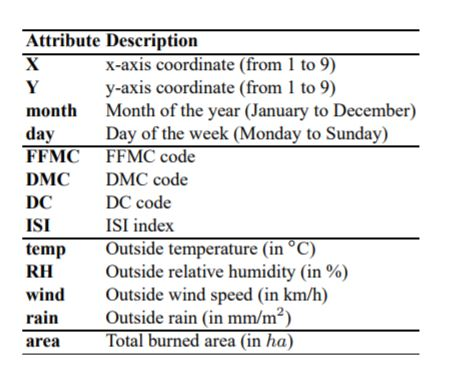
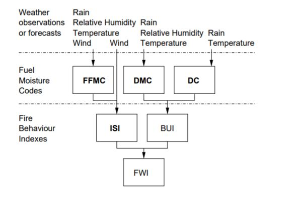
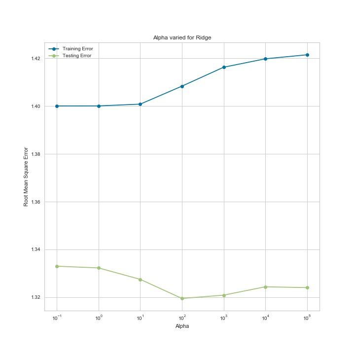
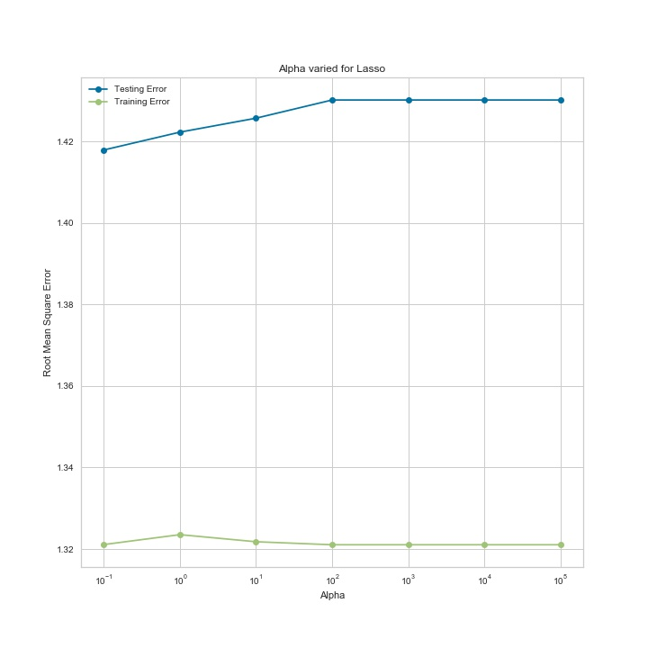
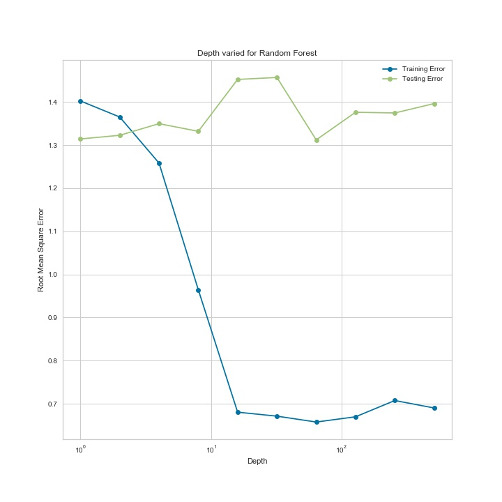

#### Introduction

Forest fires are a major environmental issue which can cause grave environmental damage and endanger human life. Fast detection is a key element to control this phenomenon
but human surveillance is expensive and subjective. The data we consider for this analysis is from the Montesinho natural park, from the northeast region of Portugal and is found in the UCI repo.

#### EDA and Feature Engineering

Following image shows the features of our original dataset

X and Y refer to the spatial coordinates within the park map. We have temporal information with month and day. The months and days were converted into dummy variables.

Meteorological information like temp, RH wind, etc. FWI is the forest Fire Weather Index (FWI) for rating fire danger. Higher values of FWI would indicate more likeliness for burning.

Our response variable is area which represents total burned area. The y variable had to be transformed as it was more skewed towards 0. Below image explains the transformation.

### Feature Selection

Applied Recursive Feature elimination (sklearn) to 3 models namely:

1. Ridge Regression

2. Lasso Regression

3. Random Forest Regression.

The features picked by them are presented in the table below:

| Model Name               | Features Selected                                                                                                                                                        |
|--------------------------|--------------------------------------------------------------------------------------------------------------------------------------------------------------------------|
| Ridge Regression         | rain and most of the temporal information like month_dec month_feb month_jan month_jun month_mar month_may month_nov month_oct month_sep day_friday_sat day_thu day_tue  |
| Lasso Regression         | Meteorological information like,RH ,wind ,rain. DMC, DC. Temporal information like,month_apr month_sep day_fri,day_mon day_sat day_sun day_thu, day_tue, day_wed         |
| Random Forest Regression | Spatial Coordinates X,Y. FWI values: FFMC,DMC,DC,ISI,temp, RH, wind. Temporal: month_aug, day_mon, day_sat, day_sun, day_tue.                                            |

### Model Selection

In this step, hyper-parameters were tuned for each model. We searched for alpha for both Lasso and Ridge and maximum depth for Random Forest Regression.

For ridge minimum error was 1.32 at alpha = 100

For lasso minimum error was 1.42 at alpha = 0.1. In this testing error is increasing while training error is decreasing. Seems over fitting. More investigation needed here.

For Random forest regression, the minimum test error we got was 1.3 at height 64. Seems overfitting here as well.

Ridge perform the best.

Source: (http://www3.dsi.uminho.pt/pcortez/fires.pdf)
